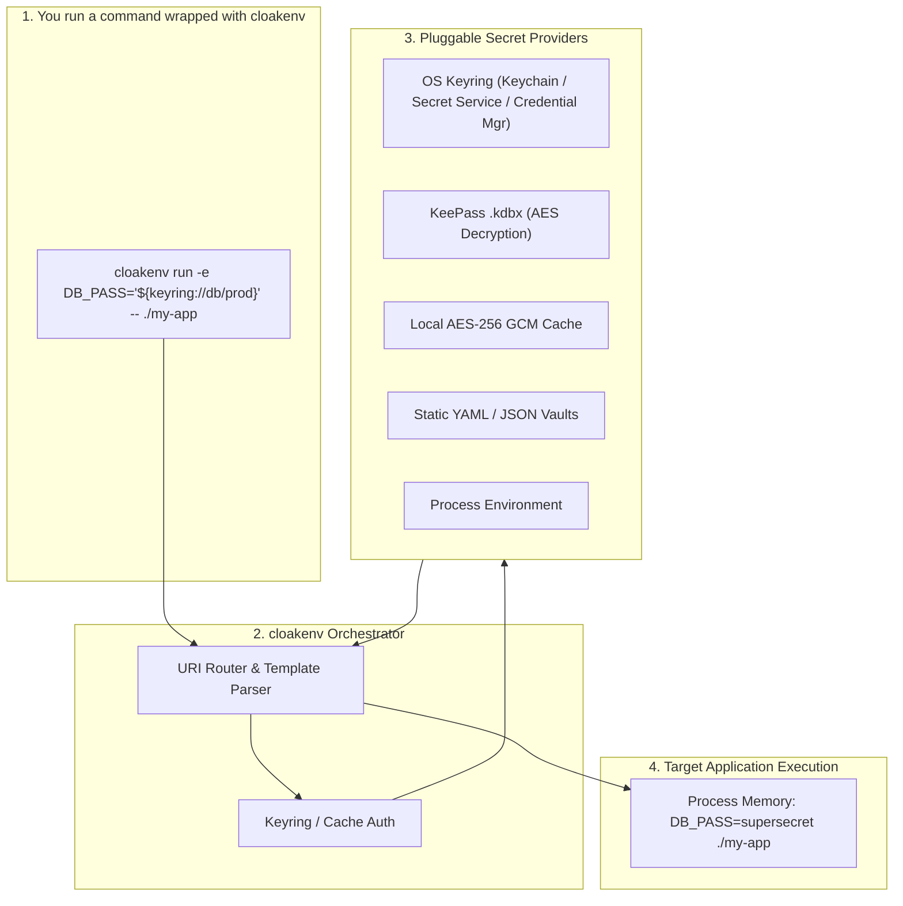

# cloakenv

[](https://goreportcard.com/report/github.com/warpcode/cloakenv)
[](LICENSE)

**Pluggable secret orchestrator and dynamic runtime environment injector.**

`cloakenv` eliminates plaintext secret sprawl. Instead of writing credentials to unencrypted `.env` files or committing secrets to git, `cloakenv` resolves secret URIs on demand from multiple backends (KeePass, OS Keyring, encrypted cache, YAML, JSON, environment) and injects them strictly into temporary execution memory right when your command runs.

---

## 📑 Table of Contents

- [Why cloakenv?](#why-cloakenv)
- [How It Works](#how-it-works)
- [Prerequisites](#prerequisites)
- [Installation](#installation)
- [Quick Start (Zero to Running in 2 Minutes)](#quick-start-zero-to-running-in-2-minutes)
- [Core Concepts](#core-concepts)
  - [URI Addressing](#uri-addressing)
  - [Explicit Expansion Syntax (`${...}`)](#explicit-expansion-syntax-)
  - [Automatic Environment Key Formatting](#automatic-environment-key-formatting)
- [CLI Command Reference](#cli-command-reference)
  - [`run` — Wrap Processes & Inject Secrets](#run--wrap-processes--inject-secrets)
  - [`get` — Extract Single Secret Raw to Stdout](#get--extract-single-secret-raw-to-stdout)
  - [`set` — Write to Keyring or Cache](#set--write-to-keyring-or-cache)
  - [`delete` — Remove from Keyring or Cache](#delete--remove-from-keyring-or-cache)
  - [`cache` — Local Encrypted Cache Management](#cache--local-encrypted-cache-management)
  - [`show` — Inspect & Export Structured Records](#show--inspect--export-structured-records)
  - [`search` — Dynamic Querying Across Vaults](#search--dynamic-querying-across-vaults)
  - [`auth` — Manage Vault Authentication](#auth--manage-vault-authentication)
  - [`internal` — Developer & Hook Helpers](#internal--developer--hook-helpers)
- [Secret Providers & Schemes](#secret-providers--schemes)
  - [Built-In Providers (Zero Setup)](#built-in-providers-zero-setup)
  - [Configured Vaults](#configured-vaults)
- [Command Autoloading & Alias Masking](#command-autoloading--alias-masking)
- [Search Query Language Reference](#search-query-language-reference)
- [Configuration Reference (`config.yaml`)](#configuration-reference-configyaml)
- [Headless & CI/CD Usage](#headless--cicd-usage)
- [Development & Testing](#development--testing)

---

## Why cloakenv?

Managing application credentials usually forces bad trade-offs:
- **Plaintext `.env` files**: Vulnerable to accidental git commits, log file leaks, and disk snooping.
- **Multiple password managers & stores**: Secrets scattered across KeePass `.kdbx` files, OS keychains, cloud vaults, and config files with no unified access pattern.
- **Verbose boilerplate**: Writing custom scripts just to decrypt a password and export it as an environment variable before starting a service.

`cloakenv` provides a single, uniform abstraction:
- **Zero Disk Persistence**: Secrets are decrypted into process memory only for the duration of the child process.
- **Universal URI Scheme**: Access any backend with the same syntax (`keyring://...`, `keepass://...`, `yaml://...`, `env://...`, `cache://...`).
- **Template Hydration**: Inject whole `.env` templates containing `${...}` secret expansions on the fly.
- **Command Autoloading**: Automatically attach the right credentials whenever specific CLI commands (like `aws`, `kubectl`, or custom tools) run.
- **Cross-Platform**: Full support for Linux, macOS, and Windows.

---

## How It Works



---

## Prerequisites

- [Go](https://go.dev/) 1.26.2 or higher.
- A supported operating system credential store:
  - **macOS**: Keychain (built-in)
  - **Linux**: D-Bus Secret Service (`gnome-keyring`, `ksecretsservice`, or `keepassxc`)
  - **Windows**: Windows Credential Manager (built-in)

---

## Installation

### Using `go install` (Recommended)

```bash
go install github.com/warpcode/cloakenv@latest
```

### Direct Execution with `go run`

```bash
go run github.com/warpcode/cloakenv@latest --help
```

### Building from Source

```bash
git clone https://github.com/warpcode/cloakenv.git
cd cloakenv
make build
# Binary is compiled to bin/cloakenv
```

---

## Quick Start (Zero to Running in 2 Minutes)

You can start using `cloakenv` immediately with the built-in providers—**no configuration file required**!

### 1. Store a secret securely in your OS Keyring

```bash
# Store an API key in your OS keyring (reads securely from stdin or interactive prompt)
echo -n "sk-proj-1234567890abcdef" | cloakenv set keyring://openai/dev_key
```

### 2. Retrieve a secret for a script or subshell

```bash
# Retrieve raw value directly to stdout (no trailing newline)
cloakenv get keyring://openai/dev_key
```

### 3. Run an application with injected secrets

```bash
# Injects OPENAI_API_KEY into the Python script's memory
cloakenv run -e OPENAI_API_KEY=keyring://openai/dev_key -- python app.py
```

`app.py` reads `os.environ["OPENAI_API_KEY"]` normally. When `app.py` exits, the secret is gone from memory, and nothing was ever written to disk!

---

## Core Concepts

### URI Addressing

Every secret is referenced through a typed URI formatted as:

$$\text{scheme://path/to/entry[:attribute]}$$

- **Scheme**: Identifies either a built-in provider (`keyring`, `env`, `cache`, `search`) or a user-defined vault name from `config.yaml` (`work`, `home`, `staging_db`).
- **Path**: Location of the credential within that provider (e.g. `service/account` for keyrings, `Group/Entry` for KeePass, `key.subkey` for JSON/YAML).
- **Attribute** *(optional)*: Specific field to retrieve (e.g., `:Password`, `:UserName`, `:api_token`, or `:attachment.txt`). Defaults to `:Password` if omitted for KeePass and custom vaults.

Examples:
```text
keyring://github/personal_access_token
env://CI_JOB_TOKEN
cache://session_token
my_vault://Production/Database:Password
my_vault://Production/Database:UserName
my_vault://Production/SSH_Keys:id_rsa.pub
json_db://servers.bastion.hostname
```

---

### Explicit Expansion Syntax (`${...}`)

`cloakenv` supports embedding secrets directly into connection strings, URLs, and template files using `${scheme://...}` syntax:

```bash
cloakenv run -e DATABASE_URL="postgres://${env://DB_USER}:${keyring://pg/password}@localhost:5432/mydb" -- ./server
```

#### Syntax Rules:
1. **Explicit Wrapping**: Secret URIs inside strings must be wrapped in `${...}` to be resolved.
2. **Escaping**: Use `$$` to escape dollar signs. For example:
   - `$$` $\rightarrow$ `$`
   - `$${env://USER}` $\rightarrow$ `${env://USER}` (unexpanded literal string).
3. **No Nesting**: Expansions cannot be nested within other expansions (`${env://${FOO}}` will return a validation error).
4. **Recursive Resolution**: Static custom vaults and `.env` template files can reference other URIs recursively (up to 5 levels deep).

---

### Automatic Environment Key Formatting

When using `-m` (entry merge) or `-e` (explicit mapping), `cloakenv` normalizes attribute and key names to standard uppercase environment variable format:
- Lowercase characters become **UPPERCASE**.
- Non-alphanumeric characters (spaces, hyphens, dots, multiple underscores) become a **single underscore (`_`)**.

| Original Attribute Name | Exported Environment Variable |
|---|---|
| `api-key` | `API_KEY` |
| `database.user_name` | `DATABASE_USER_NAME` |
| `custom---token` | `CUSTOM_TOKEN` |

---

## CLI Command Reference

Global flags:
- `-c <config_path>`: Path to custom configuration file (defaults to `~/.config/cloakenv/config.yaml`).
- `-h`, `--help`: Display usage instructions.

```
Usage:
  cloakenv [-c config_path] <command> [flags] [args]

Commands:
  run     Wrap a binary with injected environment variables
  get     Retrieve and print a single secret value raw to stdout
  set     Store a secret value at a writable URI (keyring://, cache://)
  delete  Remove a secret from a writable URI (keyring://, cache://)
  cache   Manage local encrypted cache (subcommand: clear)
  show    Retrieve and display a structured entry
  search  Search for structured entries across vaults
  auth    Manage vault credentials and status (login, forget, status)
  internal  Developer & hook helpers (match-alias)
```

---

### `run` — Wrap Processes & Inject Secrets

Wraps and executes a target command, injecting resolved environment variables directly into its process environment.

```bash
cloakenv run [-E] [flags] -- <command> [args...]
```

> [!TIP]
> If the `--` separator is omitted, all remaining positional arguments are treated as the command.

#### Flags:
- `-E`: Start with an empty environment (do not inherit from parent process). Useful for wrapping untrusted processes or preventing secret leakage from the parent shell.
- `-e KEY=uri`: Explicitly map an environment variable to a secret URI (repeatable).
- `-t template_path`: Load a `.env` template file containing `KEY=uri` or literal definitions (repeatable).
- `-m entry-uri`: Merge all attributes from a structured entry into the environment (repeatable). Can target a single attribute using `:attribute`.
- `-i KEY`: Whitelist key filter (repeatable). When `-i` is specified, only the whitelisted keys from `-m` merges are injected. (`-e` mappings always bypass whitelist filtering).
- `--no-autoload`: Bypass configuration `autoload:` rules for this execution.

#### Examples:

```bash
# 1. Map single environment variables explicitly
cloakenv run -e API_KEY=keyring://stripe/secret_key -- node server.js

# 2. Merge an entire KeePass entry (injects all attributes as UPPERCASE_VARS)
cloakenv run -m "work://Production/PostgreSQL" -- ./migrate-db

# 3. Merge an entry but whitelist only specific fields
cloakenv run -m "work://Production/PostgreSQL" -i USERNAME -i PASSWORD -- ./migrate-db

# 4. Load a template .env file
cloakenv run -t ./deploy.env -- terraform apply

# 5. Combine template, merge, and explicit overrides
cloakenv run \
  -t .env.template \
  -m "work://Cloud/AWS_Production" \
  -e REGION="us-east-1" \
  -- aws s3 ls
```

---

### `get` — Extract Single Secret Raw to Stdout

Resolves and outputs a single secret value raw to standard output with **no trailing newline**. Ideal for piping into clipboards, shells, and other CLI utilities.

```bash
cloakenv get <uri>
```

#### Examples:

```bash
# Copy secret directly to macOS clipboard
cloakenv get keyring://github/token | pbcopy

# Capture into shell variable in a bash script
export GITHUB_TOKEN=$(cloakenv get keyring://github/token)

# Retrieve a specific KeePass attribute
cloakenv get "work://Servers/Bastion:UserName"

# Stream a KeePass file attachment (e.g. private key or certificate)
cloakenv get "work://Infrastructure/SSH:id_rsa" > ~/.ssh/id_rsa_temp
```

---

### `set` — Write to Keyring or Cache

Writes a secret to a writable provider (`keyring://` or `cache://`). The secret value is read securely from standard input (stdin) or an interactive masked prompt, preventing exposure in shell history or process lists.

```bash
cloakenv set <uri> [--ttl <duration>]
```

- The secret value is securely read from standard input (stdin) or prompted interactively if running in a terminal.
- `--ttl <duration>`: Optional Time-To-Live expiration (e.g. `5m`, `1h`, `24h`) for `cache://` secrets.

#### Examples:

```bash
# 1. Interactive masked terminal prompt (no secret in bash history!)
cloakenv set keyring://aws/secret_access_key

# 2. Pipe secret from another CLI tool or file
cat ~/.my_token | cloakenv set keyring://app/token

# 3. Store a temporary session token in cache for 30 minutes
echo -n "temp_jwt_token_xyz" | cloakenv set cache://session_token --ttl 30m
```

---

### `delete` — Remove from Keyring or Cache

Deletes a secret from a writable backend (`keyring://` or `cache://`).

```bash
cloakenv delete <uri>
```

#### Examples:

```bash
cloakenv delete keyring://aws/secret_access_key
cloakenv delete cache://session_token
```

---

### `cache` — Local Encrypted Cache Management

`cloakenv` provides a local, file-based encrypted cache (`cache://`). Cached files are encrypted on disk with **AES-256-GCM**, using an encryption key generated and stored inside your native OS keyring.

```bash
# Clear all cached items immediately
cloakenv cache clear
```

---

### `show` — Inspect & Export Structured Records

Retrieves and formats a structured credential record (or multiple merged records).

```bash
cloakenv show <entry-uri> [flags]
# or
cloakenv show -m <entry-uri> [-m <entry-uri> ...] [flags]
```

#### Flags:
- `-o, --output`: Output format: `yaml` (default), `json`, `env` (dotenv), or `keys`.
- `-m entry-uri`: Merge additional entries (repeatable).
- `-e KEY=uri`: Explicit key override (repeatable).
- `-t template_path`: Load template `.env` file (repeatable).
- `-i KEY`: Whitelist filter keys (repeatable).

#### Output Formats:
1. **`yaml`** (Default): Formatted YAML document.
2. **`json`**: Formatted, indented JSON object.
3. **`env`**: Valid dotenv formatted lines with appropriate escaping and quotes (`KEY="value"`).
4. **`keys`**: Plain list of exported environment variable names (one per line).

#### Examples:

```bash
# Inspect KeePass record as YAML
cloakenv show "work://Production/Database"

# Export record as a .env file
cloakenv show "work://Production/Database" -o env > .env.local

# View all available key names in an entry
cloakenv show "work://Production/Database" -o keys

# Merge multiple sources and export as JSON
cloakenv show \
  -m "work://Production/Database" \
  -e DB_PORT="5432" \
  -o json
```

---

### `search` — Dynamic Querying Across Vaults

Searches for structured entries across all configured searchable vaults using Go `expr` query syntax.

```bash
cloakenv search "[query_expression]" [flags]
```

#### Flags:
- `--vault <vault_name>`: Scope the search to one or more specific vaults (repeatable).
- `-i KEY`: Select only specific attributes/fields in the output (repeatable).
- `-o, --output`: Output format: `yaml` (default) or `json`.

#### Examples:

```bash
# Search for entries with a specific tag
cloakenv search '"auth:ssh" in tags'

# Search for RSA keys with 4096-bit strength
cloakenv search 'bit_strength == 4096'

# Search by title prefix across a specific vault
cloakenv search 'title startsWith "Staging"' --vault work

# Return only the hostnames and usernames from matching entries
cloakenv search '"env:prod" in tags' -i title -i hostname -i username -o yaml
```

---

### `auth` — Manage Vault Authentication

Manages master passwords and access verification for vaults requiring credentials (such as KeePass databases).

```bash
cloakenv auth <login|forget|status> [vault_name]
```

- **`login <vault>`**: Prompts for the vault master password and securely stores it in your OS Keyring under the `cloakenv` service prefix.
- **`forget <vault>`**: Clears the saved master password from the OS Keyring.
- **`status [vault]`**: Tests if configured vaults are currently unlocked and accessible.

#### Examples:

```bash
# 1. Unlock your work KeePass database once
cloakenv auth login work

# 2. Verify all vaults are active
cloakenv auth status
# Output:
# work: ACTIVE
# home: ACTIVE

# 3. Clear credentials when locking down
cloakenv auth forget work
```

---

### `internal` — Developer & Hook Helpers

Internal helper commands for scripting and automation. These are not intended for direct end-user usage.

```
Usage:
  cloakenv internal <subcommand> [args]
```

#### `match-alias` — Check Autoload Rule Matches

Tests whether a command matches any configured `autoload:` rule without resolving secrets or triggering side effects. Useful for external shell hooks that need to detect whether `cloakenv run` would apply autoload rules to a given command.

```bash
cloakenv internal match-alias [--json] -- <command> [args]
```

- Exits with code **0** if a match is found, **1** if no match.
- `--json`: Output structured JSON with the matched rule details (`match`, `command`, `vaults`, `merge`, `env`, `whitelist`).

#### Examples:

```bash
# Check if "aws s3 ls" matches any autoload rule
cloakenv internal match-alias -- aws s3 ls

# Get structured JSON output for scripting
cloakenv internal match-alias --json -- kubectl get pods
```

---

## Secret Providers & Schemes

### Built-In Providers (Zero Setup)

These providers are always available and do not require registration in `config.yaml`:

| URI Scheme | Type | Description |
|---|---|---|
| `keyring://service/account` | Read / Write | OS native secure credential store (macOS Keychain, Linux D-Bus, Windows Credential Manager). |
| `env://VAR_NAME` | Read-Only | Values from the parent process environment. Great for CI/CD pipelines. |
| `cache://KEY` | Read / Write | Local AES-256-GCM encrypted filesystem cache with optional TTL. Encryption key is in OS Keyring. |
| `search://query/attribute` | Read-Only | Dynamic URI resolution! Executes a search query on the fly and retrieves the matching attribute. |

#### Dynamic `search://` URI Scheme Example:

```bash
# Dynamically finds the entry with tags "env:prod" and "service:redis" and extracts its Password
cloakenv get "search://tags=env:prod,service:redis&title=Cluster/Password"
```

---

### Configured Vaults

Configure external databases in `~/.config/cloakenv/config.yaml`:

```yaml
vaults:
  work:
    provider: "keepass"
    vault_path: "~/secrets/work.kdbx"

  infra_yaml:
    provider: "yaml"
    vault_path: "~/secrets/infra.yaml"
    entities_root_key: "entries"

  hosts_json:
    provider: "json"
    vault_path: "~/secrets/hosts.json"
    entities_root_key: "hosts"

  static_vault:
    provider: "custom_vault"
    entities:
      database:
        username: "postgres"
        Password: "${keyring://db/prod_password}"
```

#### 1. KeePass (`keepass`)
- Points to any KeePass 2.x `.kdbx` file.
- Path traversal: `vault://Folder/SubFolder/EntryName[:Attribute]`.
- Defaults to `:Password` attribute if omitted.
- **File Attachments**: Directly stream binary attachments by name (e.g. `vault://SSH/Keys:id_rsa`).

#### 2. YAML (`yaml`) & JSON (`json`)
- Reads static structured YAML or JSON files.
- Supports dot-separated object navigation (`vault://servers.bastion.hostname`) and array index addressing (`vault://servers.bastion.public_keys.0`).
- Supports multi-entity registries (under `entities_root_key`) or flat single-entity databases (`single_entity: true`).

#### 3. Custom Vault (`custom_vault`)
- Defined directly inside `config.yaml` with no external files.
- Set `resolve_values: true` to enable recursive resolution of `${...}` URIs inside the configuration.

---

## Command Autoloading & Alias Masking

`cloakenv` can automatically match commands executed via `cloakenv run -- <command>` and inject credentials, merge vaults, or transform the command line before execution.

Define `autoload:` rules in `~/.config/cloakenv/config.yaml`:

```yaml
autoload:
  # Example 1: Command Transformation / Alias Masking
  # Running: `cloakenv run -- litellm --config config.yaml`
  # Expands to: `uvx --with 'litellm[proxy]' litellm --config config.yaml`
  # while injecting LITELLM_MASTER_KEY!
  - match: "^litellm\\s+(.*)$"
    command: "uvx --with 'litellm[proxy]' litellm \\1"
    env:
      LITELLM_MASTER_KEY: "keyring://litellm/master_key"

  # Example 2: AWS CLI Autoloading
  - match: "aws"
    vaults:
      - "work://Cloud/AWS_Production"
    env:
      AWS_DEFAULT_REGION: "env://DEFAULT_REGION"
    whitelist:
      - "AWS_ACCESS_KEY_ID"
      - "AWS_SECRET_ACCESS_KEY"
      - "AWS_DEFAULT_REGION"

  # Example 3: Wildcard / Glob Matching
  - match: "kubectl*"
    merge:
      - "infra_yaml://clusters/staging"
    env:
      KUBECONFIG_TOKEN: "keyring://k8s/token"
```

### Pattern Matching Types:
1. **Regular Expressions**: `match: "^(aws|terraform)\\s+(.*)$"` with capture group substitutions (`\1`..`\9` or `$1`..`$9`) in `command:`.
2. **Executable Basename & Path**: `match: "aws"` matches `aws`, `/usr/local/bin/aws`, or `aws s3 ls`.
3. **Glob Patterns**: `match: "npm run *"` or `match: "*.sh"`.

---

## Search Query Language Reference

`cloakenv search` evaluates queries using the fast, safe [Go expr](https://github.com/expr-lang/expr) engine. Queries run against flattened entry objects containing `title`, `path`, `tags`, and all custom attributes.

### 1. Tag & Array Membership (`in`, `not in`)

```bash
# Entry must contain tag "auth:ssh"
cloakenv search '"auth:ssh" in tags'

# Entry must NOT contain tag "deprecated"
cloakenv search 'not ("deprecated" in tags)'

# Combined tags
cloakenv search '"env:prod" in tags and "role:db" in tags'
```

### 2. Numbers & Comparisons

```bash
cloakenv search 'bit_strength == 4096'
cloakenv search 'port >= 8000 and port <= 9000'
```

### 3. String Functions

```bash
# Substring search
cloakenv search 'title contains "Bastion"'

# Case-insensitive substring search
cloakenv search 'lower(title) contains "bastion"'

# Prefix and Suffix matching
cloakenv search 'title startsWith "Prod-"'
cloakenv search 'hostname endsWith ".internal.net"'

# Regular expression matching
cloakenv search 'hostname matches "db-[0-9]+\\.example\\.com"'
```

### 4. Boolean Combinations

```bash
cloakenv search '("auth:ssh" in tags or "auth:tls" in tags) and bit_strength >= 2048'
```

> [!NOTE]
> If an entry lacks a field referenced in the search query (e.g. searching `bit_strength == 4096` when some entries have no `bit_strength` attribute), `cloakenv` **gracefully skips** non-matching entries without raising runtime errors.

> [!NOTE]
> The search engine uses a **strict allowlist** for expression nodes. Only safe primitives, builtins, comparisons, and boolean logic are permitted. Arbitrary function calls and method invocations on entries are blocked for security.

---

## Configuration Reference (`config.yaml`)

Default path: `~/.config/cloakenv/config.yaml` (override with `-c <path>`).

```yaml
# ==========================================
# Cache Configuration
# ==========================================
cache:
  # Default TTL duration for cache:// sets if --ttl is omitted
  default_ttl: "10m"

# ==========================================
# Keyring Configuration
# ==========================================
keyring:
  # Service prefix used in the OS keyring
  prefix: "cloakenv"

# ==========================================
# Configured Vaults
# ==========================================
vaults:
  # KeePass .kdbx Vault
  work:
    provider: "keepass"
    vault_path: "~/secrets/work.kdbx"
    searchable: true

  # YAML File Vault (multiple entities)
  infra_yaml:
    provider: "yaml"
    vault_path: "./examples/providers/yaml/database.yaml"
    entities_root_key: "entries" # Use "." for document root

  # JSON File Vault
  hosts_json:
    provider: "json"
    vault_path: "./examples/providers/json/database.json"
    entities_root_key: "entries"

  # Flat Single-Entity Dotenv Vault
  dotenv_dev:
    provider: "yaml"
    vault_path: "./examples/providers/yaml/dotenv.yaml"
    single_entity: true
    entity_name: "Local Development Config"
    tags: ["env:dev", "local"]

  # Inline Custom Vault (with recursive URI resolution)
  custom_static:
    provider: "custom_vault"
    resolve_values: true
    entities:
      api_gateway:
        username: "admin"
        Password: "${keyring://gateway/admin_pass}"
        tags: ["static", "gateway"]

# ==========================================
# Command Autoloading Rules
# ==========================================
autoload:
  - match: "^litellm\\s+(.*)$"
    command: "uvx --with 'litellm[proxy]' litellm \\1"
    env:
      LITELLM_MASTER_KEY: "keyring://litellm/master_key"

  - match: "aws"
    vaults:
      - "work://Cloud/AWS_Production"
    whitelist:
      - "AWS_ACCESS_KEY_ID"
      - "AWS_SECRET_ACCESS_KEY"
```

---

## Headless & CI/CD Usage

`cloakenv` is built to run seamlessly in continuous integration (GitHub Actions, GitLab CI) and headless Docker containers:

1. **Use `env://` mappings**: Point secrets to CI environment variables:
   ```yaml
   # .github/workflows/deploy.yml
   - name: Deploy
     run: |
       cloakenv run \
         -e DB_PASS=env://SECRET_DB_PASSWORD \
         -e API_KEY=env://SECRET_API_KEY \
         -- ./deploy.sh
   ```
2. **Static JSON/YAML or custom vaults**: Mount encrypted or pipeline-generated files without requiring interactive master password prompts.
3. **Zero Interactive Prompts**: When secrets are supplied via `env://` or files, `cloakenv` never prompts for terminal input.

---

## Development & Testing

### Common Makefile Targets

```bash
make build       # Compile binary to bin/cloakenv
make test        # Run tests with race detector (go test -v -race ./...)
make bench        # Run performance benchmarks
make fmt         # Format Go source code (go fmt ./...)
make vet         # Run Go static analysis (go vet ./...)
make test-all    # Run fmt, vet, test, and bench in sequence
make install     # Install binary to $GOBIN or $GOPATH/bin
make uninstall   # Remove installed binary
```

> [!NOTE]
> CI runs lint, cross-platform tests (Linux, macOS, Windows), and [Semgrep](https://semgrep.dev/) static analysis for code scanning. All checks must pass before merge.

### Running Test Verification with Test Fixture

A pre-built KeePass database fixture is available at `testdata/testDB.kdbx`:
- **Master Password**: `password123`
- **Group**: `website` $\rightarrow$ **Entry**: `Test Website`
- **Attributes**: `Password` (`testPassword123!`), `UserName` (`user@email.com`), Attachment `hello.txt`

```bash
# Test KeePass authentication and attribute resolution
echo "password123" | ./bin/cloakenv -c testdata/test_config.yaml auth login testdb
./bin/cloakenv -c testdata/test_config.yaml get "testdb://website/Test Website:UserName"
./bin/cloakenv -c testdata/test_config.yaml auth forget testdb
```

---

## License

MIT License. See [LICENSE](LICENSE) for details.
